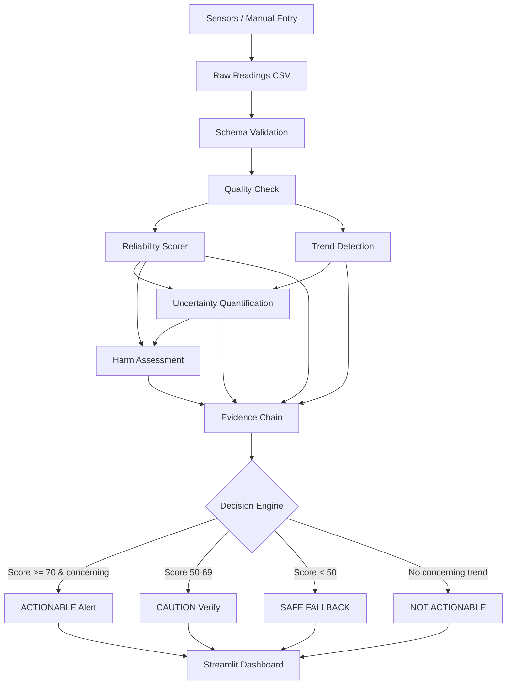

# Architecture

## Data Flow Diagram



## Component Responsibilities

| Module | Input | Output |
|--------|-------|--------|
| `data/generator.py` | Scenario config | Simulated readings + ground truth |
| `pipeline/quality_check.py` | Readings DataFrame | QualityReport (gaps, conflicts, stale) |
| `pipeline/reliability_scorer.py` | QualityReport | ReliabilityScore (0-100 + components) |
| `pipeline/trend_detection.py` | Readings DataFrame | TrendResult (slope, p-value, concerning) |
| `pipeline/uncertainty.py` | Score + Trend | UncertaintyEstimate (confidence %) |
| `pipeline/harm_assessment.py` | Score + Trend + Uncertainty | HarmAssessment (cost items) |
| `pipeline/evidence.py` | All above | EvidenceChain (audit trail) |
| `pipeline/decision.py` | All above | ClinicalDecision (outcome + fallback) |
| `baseline/simple_scorer.py` | Readings DataFrame | BaselineResult (naive alert) |
| `dashboard/app.py` | Pipeline output | Interactive care-team UI |

## Deployment Topology

```
┌─────────────────┐     ┌──────────────────┐     ┌─────────────────┐
│  Device Cloud   │────▶│  Data Pipeline   │────▶│  Scorer Engine  │
│  + Manual Entry │     │  (ETL + Validate)│     │  (Python)       │
└─────────────────┘     └──────────────────┘     └────────┬────────┘
                                                          │
                        ┌──────────────────┐              │
                        │  Streamlit UI    │◀─────────────┘
                        │  (Care Teams)    │
                        └──────────────────┘
```

## Safe Fallback Behavior

When reliability score < 50:
- Trend alerts are **suppressed**
- Dashboard shows red SAFE FALLBACK banner
- Specific re-collection actions are listed
- Re-check scheduled at 24h interval
- Harm assessment quantifies cost of acting anyway
